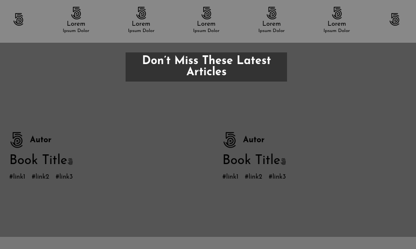

# design-teardown-project
In this simple project, we breake apart the website for a popular design magazine with which you’re probably familiar by now – Smashing Magazine. 

## Built With

- HTML
- CSS

## Screenshot

e
## Live Demo

https://design-teardown.netlify.com

## Authors

👤 **FRANCO ROSA**

- Github: [@FrancoRosa](https://github.com/FrancoRosa)
- Linkedin: [linkedin](https://www.linkedin.com/in/franco-rosa-79972119b)

👤 **Azamat Nuriddinov**

- Github: [@bettercallazamat](https://github.com/bettercallazamat)
- Twitter: [@azamat_nuriddin](https://twitter.com/azamat_nuriddin)
- Linkedin: [Azamat Nuriddinov](https://www.linkedin.com/in/azamat-nuriddinov-57579868)

## 🤝 Contributing

Contributions, issues and feature requests are welcome!

Feel free to check the [issues page](issues/).

## Show your support

Give a ⭐️ if you like this project!

## 📝 License

This project is [MIT](lic.url) licensed.
